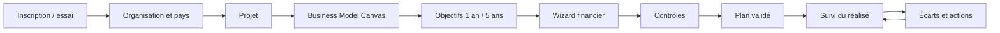

# Spécification produit initiale

**Statut :** Draft  
**Version :** 0.1

## Entités

- **Compte** : identité de connexion.
- **Organisation** : espace client, abonnement, membres et paramètres.
- **Projet** : entreprise ou initiative planifiée et suivie.
- **Scénario** : ensemble versionné d’hypothèses.
- **Country Pack** : configuration pays, référentiel, fiscalité et devise.
- **Plan financier** : résultats calculés et figés.
- **Période réalisée** : données observées avec origine.
- **Rapport** : vue exportable d’une version.

## Cycle principal

## Onboarding

À la première connexion, l’utilisateur crée ou rejoint une organisation, renseigne pays, devise et secteur, démarre l’essai de 14 jours puis crée son premier projet. Les limites dépendent du plan.

## Country Packs

Le pays détermine une version de pack comprenant devise, formats, référentiel comptable, catégories fiscales, taux et dates d’effet, charges sociales, arrondis, sources et niveau de validation.

La V1 vise la RDC avec SYSCOHADA. Aucun message ne doit affirmer une couverture mondiale avant validation des packs.

## Business Model Canvas

Les neuf blocs standards sont présents. Ils peuvent être liés à des hypothèses financières, mais toute suggestion doit être confirmée avant d’alimenter un scénario.

## Wizard financier

1. Identité et activité.
2. Objectifs à 1 an et 5 ans.
3. Produits, services, prix et volumes.
4. Investissements et immobilisations.
5. Financement et apports.
6. Achats et coûts variables.
7. Charges fixes.
8. Personnel.
9. Encaissements, décaissements et délais.
10. Fiscalité et paramètres pays.
11. Trésorerie de départ.
12. Synthèse, contrôles et validation.

Chaque champ possède définition, exemple, unité, période, caractère obligatoire, source et validations. Le wizard sauvegarde automatiquement.

## Plan financier

Le moteur génère sur cinq ans :

- compte de résultat;
- plan de trésorerie;
- plan de financement;
- bilan prévisionnel;
- besoin en fonds de roulement;
- capacité d’autofinancement;
- seuil de rentabilité et point mort;
- échéanciers;
- ratios et indicateurs.

La vue annuelle est obligatoire. La vue mensuelle dépend du plan et du détail des hypothèses.

## Diagnostics

Le premier périmètre couvre rentabilité, trésorerie de départ, financement, atteinte des objectifs et risque. Chaque diagnostic comprend statut, preuves chiffrées, explication, causes et recommandations.

## Prévisionnel / réalisé

Les données réelles restent séparées du plan validé. Lalanda affiche réalisé, budget, écarts, tendances, projection, trésorerie, marge, charges, croissance, BFR, burn rate et runway lorsque pertinents.

## IA

L’IA explique, résume, détecte des anomalies et suggère des actions. Elle ne calcule pas les états, ne modifie pas un scénario sans confirmation et ne présente pas une règle non sourcée comme certaine.

## Rôles

Plateforme : super administrateur, administrateur, support, finance/facturation, éditeur de templates, gestionnaire comptable/fiscal.

Organisation : propriétaire, administrateur, directeur financier, comptable, analyste, chef de projet, conseiller, lecteur.

## Offre — hypothèse à valider

Quatre offres maximum hors essai : Starter, Pro, Business et Enterprise. L’essai dure 14 jours. Les prix et limites seront validés par recherche marché. Facturation mensuelle ou annuelle avec remise explicite.
