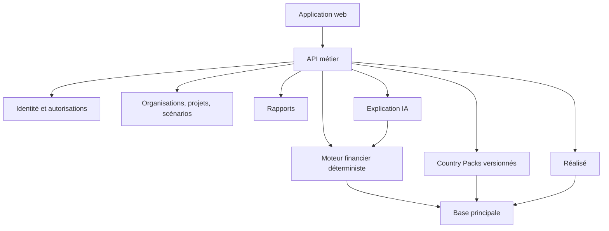

# Architecture — principes fondateurs

**Statut :** Draft  
**Version :** 0.1

## Objectifs

- Calculs fiables, reproductibles et testables.
- Séparation entre saisie, calcul, diagnostic, présentation et narration.
- Isolation forte des organisations.
- Évolution multi-pays par configuration versionnée.
- Traçabilité des changements et exports.

## Architecture logique

L’IA lit des résultats structurés; elle n’est jamais une source de vérité numérique.

## Socle proposé

À confirmer par ADR : monorepo TypeScript, Next.js, NestJS, MongoDB si le brief source le confirme, moteur de formules isolé, ExcelJS, stockage objet, file de tâches et observabilité centralisée.

Les versions exactes seront décidées au démarrage et verrouillées.

## Source unique des calculs

Une formule possède un identifiant stable, une version, des entrées typées, une règle d’arrondi, des dépendances, un résultat, une explication et des tests.

Le web, l’API, les exports et diagnostics consomment les mêmes résultats. Aucune formule métier n’est réimplémentée dans l’interface.

## Versionnement

Un plan validé référence versions des entrées, scénario, moteur et Country Pack, date de calcul, devise et politique d’arrondi.

## Sécurité

- contrôle côté serveur;
- portée organisation et projet;
- moindre privilège;
- journal d’audit;
- chiffrement;
- secrets hors dépôt;
- sauvegardes et restaurations testées.

## Qualité

- tests unitaires des formules;
- tests d’intégration;
- golden files du classeur source;
- validation des exports Excel avec LibreOffice;
- tests multi-tenant et permissions;
- règles pays versionnées.

## Décisions ouvertes

Base de données, moteur de formules, authentification, paiements, stockage, file de tâches, hébergement, régions, IA et résidence des données. Chaque décision sera consignée dans `docs/adr/`.
