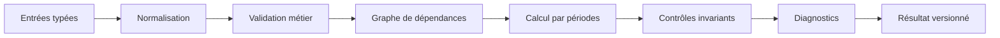

# Moteur financier

**Statut :** Draft  
**Version :** 0.1

## Responsabilité

Transformer un jeu d’entrées validé, un scénario et un Country Pack en résultats financiers déterministes. Le moteur ne gère ni interface, ni autorisation, ni texte IA.

## Pipeline



## Contrat d’entrée

- projet, scénario et version;
- calendrier;
- devise fonctionnelle;
- hypothèses de revenus;
- coûts variables et fixes;
- personnel;
- investissements;
- financements;
- délais et BFR;
- trésorerie initiale;
- objectifs;
- Country Pack et version.

## Registre de formules

Chaque formule possède :

```ts
type FormulaDefinition = {
  id: string;
  version: string;
  output: string;
  dependencies: string[];
  periodBehavior: "flow" | "stock" | "ratio";
  roundingPolicy: string;
  explanationKey: string;
};
```

Les fonctions sont pures autant que possible. Les dépendances cycliques sont refusées ou traitées par un mécanisme explicitement documenté.

## Périodes

- un flux s’additionne;
- un stock se reporte;
- un ratio est recalculé, pas additionné;
- le solde final devient l’ouverture suivante;
- les dates d’encaissement et décaissement déterminent la trésorerie;
- les agrégations annuelles dérivent des périodes élémentaires.

## Arrondis

La précision de calcul est supérieure à celle d’affichage. L’arrondi final suit une politique versionnée. Les écarts d’arrondi sont expliqués et affectés à des lignes identifiées.

## Explicabilité

Pour chaque résultat, le moteur peut produire :

- formule ou règle;
- dépendances;
- valeurs utilisées;
- étapes intermédiaires utiles;
- version;
- avertissements.

## Exécution

Une exécution est idempotente pour la même empreinte d’entrée. Le cache utilise cette empreinte. Un résultat incomplet ou invalide n’est jamais approuvé.

## Contrôles

- équilibre bilan;
- continuité de trésorerie;
- cohérence dette;
- cohérence immobilisations;
- résultat vers capitaux propres;
- taxes applicables;
- absence de valeur non finie;
- unité et devise cohérentes.

## Feuille amortissements SYSCOHADA (S14c)

En plus des feuilles calculées par le DSL, le moteur produit une feuille
synthétique `amortissements` quand le template déclare un champ
`immobilisations`. Cette feuille est calculée hors HyperFormula car sa forme
(colonnes = années × immobilisations) ne se prête pas au modèle
ligne/formule du DSL.

**Entrée :** liste d’immobilisations `[{ label, categorie, montant_ht,
date_acquisition, valeur_residuelle?, duree_annees? }]` plus l’horizon
`horizon_projection_annees` (défaut 3).

**Règle de calcul :**

- méthode linéaire ;
- durée par défaut fournie par la catégorie SYSCOHADA (voir Country Packs) ;
- base amortissable = `montant_ht − valeur_residuelle` ;
- dotation année pleine = base / durée ;
- prorata temporis 1re année : `(12 − mois_acquisition + 1) / 12` — la 1re
  année produit une dotation partielle, la dernière année reprend le
  reliquat pour que la somme des dotations = base amortissable ;
- VNC en fin d’année N = `montant_ht − Σ dotations jusqu’à N` ;
- au-delà de la durée, la dotation est nulle et la VNC reste à la valeur
  résiduelle.

**Sorties :**

- une ligne par immobilisation × année (dotation) ;
- une ligne par immobilisation × année (VNC fin de période) ;
- ligne total DAP par année ;
- ligne total VNC par année.

**Impact sur les autres feuilles :**

- si une ligne `dotations_amortissements` existe dans le template, sa valeur
  est surchargée par le total DAP année 1 (la feuille amortissements devient
  la source unique) ;
- pour chaque `resultat_annuel_N` de la projection, une ligne
  `resultat_annuel_N_apres_amort` est ajoutée avec la DAP soustraite ;
- aucun impact sur la trésorerie (les dotations sont des flux comptables
  non-monétaires — vérifié par un test de non-régression).

Un template sans `immobilisations` n’active aucun de ces comportements —
compatibilité totale avec les templates S6 à S13.

## Compatibilité

Le moteur peut évoluer, mais les versions historiques restent exécutables ou leurs résultats figés restent disponibles avec preuve d’intégrité.
